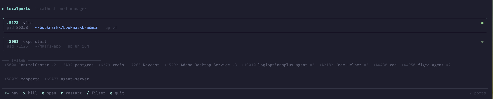

<p align="center">
  
</p>

<p align="center">
  A beautiful interactive TUI for managing localhost ports on macOS.<br/>
  See what's running, kill it, restart it in a new tab, relaunch recent dev servers without remembering the command.
</p>

<br/>

<p align="center">
  
</p>

<br/>

## Install

```sh
npm install -g localports
```

Or run without installing:

```sh
npx localports
```

---

```
◉ localports  localhost port manager

╭──────────────────────────────────────────────────────────╮
│ :3000  next dev                                        ●  │
│ pid 41021   ~/petal   up 2h 14m                          │
╰──────────────────────────────────────────────────────────╯
╭──────────────────────────────────────────────────────────╮
│ :8081  expo start                                      ●  │
│ pid 32910   ~/maffs-app   up 12m                         │
╰──────────────────────────────────────────────────────────╯

─── recent ────────────────────────────────────────────────
  :5173  vite   ~/dashboard

─── system ────────────────────────────────────────────────
  :5432 postgres   :6379 redis   :44438 zed   :44950 Figma ×2

──────────────────────────────────────────────────────────
  ↑↓ nav  x kill  o open  r restart  / filter  q quit
```

## Usage

```sh
localports
```

Scans all listening TCP ports every 2 seconds. Dev ports appear as cards, system daemons in a compact row at the bottom.

## Keys

| Key | Action |
|-----|--------|
| `↑` `↓` or `j` `k` | Navigate |
| `x` | Kill selected port (SIGTERM) |
| `o` | Open in browser |
| `r` | Restart (kills + reopens in new terminal tab) |
| `/` | Enter filter mode |
| `esc` | Clear filter / quit |
| `q` | Quit |

**When a history entry is selected:**

| Key | Action |
|-----|--------|
| `r` | Start — opens a new terminal tab and runs the last command |
| `x` | Remove from history |

## Features

**Live scanning** — ports appear and disappear in real time as processes start and stop.

**Smart labels** — resolves process titles like `next-server (v16.1.6)` back to readable names like `next dev`. Shows the working directory and uptime for each port.

**Kill is instant** — the card vanishes the moment you press `x`. If the process ignores SIGTERM and survives 4 seconds, the card reappears.

**Restart in new tab** — `r` kills the process and reopens the command in a new terminal tab so you can see the output. Resolves the right command from `package.json` scripts and detects your package manager (npm/pnpm/yarn/bun).

**Port history** — when a dev port disappears, it moves to a *recent* section. Navigate to it and press `r` to relaunch without searching for the command.

**Filter** — press `/` to enter filter mode. Type to match by port number, command name, or directory. `esc` clears.

**System port grouping** — repeated processes (Code Helper ×3, Adobe ×3) are collapsed into a single line.

## Terminal support

New tabs are opened natively per terminal. The System Events approach (Warp, Ghostty) requires macOS Accessibility permission on first use.

| Terminal | Method |
|----------|--------|
| iTerm2 | AppleScript — native tab API |
| Terminal.app | AppleScript — `do script` in new tab |
| Warp | System Events — `⌘T` + keystrokes |
| Ghostty | System Events — `⌘T` + keystrokes |
| Others | Terminal.app fallback (new window) |

## Requirements

- macOS (uses `lsof`, `osascript`)
- Node.js 18+

## Contributing

PRs welcome. The codebase is straightforward:

```
src/
  cli.tsx              # entry point
  App.tsx              # root component, nav state
  components/
    PortCard.tsx        # live port card
    HistorySection.tsx  # recent ports
    SystemRow.tsx       # grouped system daemons
    StatusBar.tsx       # keybind hints
  hooks/
    usePorts.ts         # async lsof scanner + PID cache
    useHistory.ts       # history read/write
    useKeymap.ts        # keyboard input
  lib/
    history.ts          # ~/.localports/history.json persistence
    terminal.ts         # per-terminal tab opening
```

```sh
git clone https://github.com/moh-hit/localports
cd localports
npm install
npm run dev
```

## License

MIT
